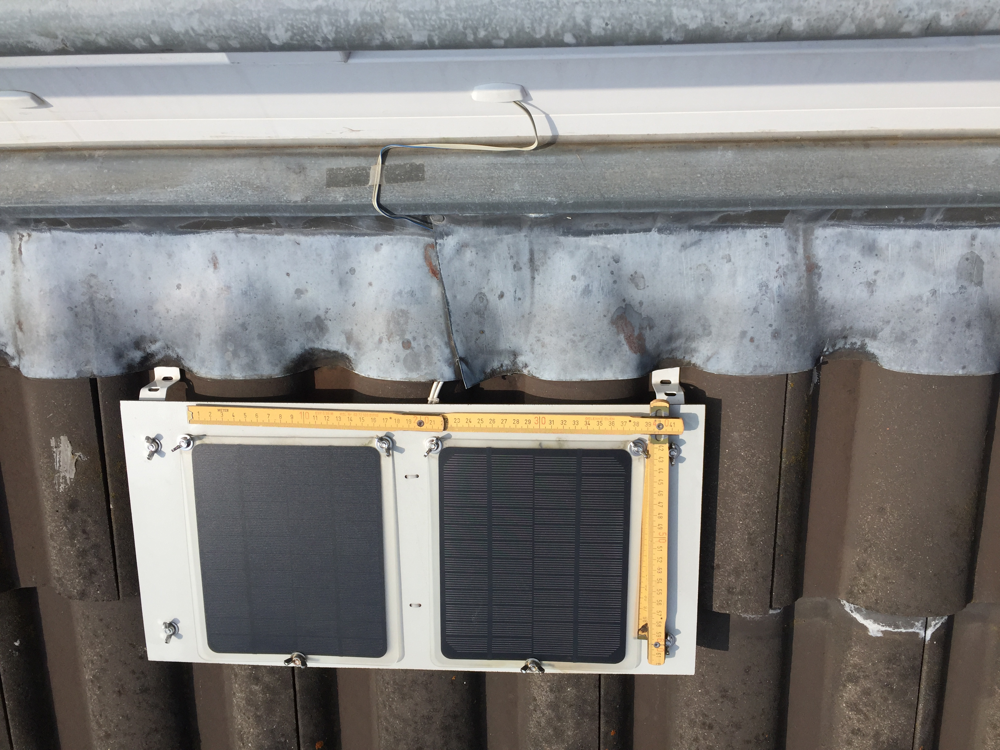
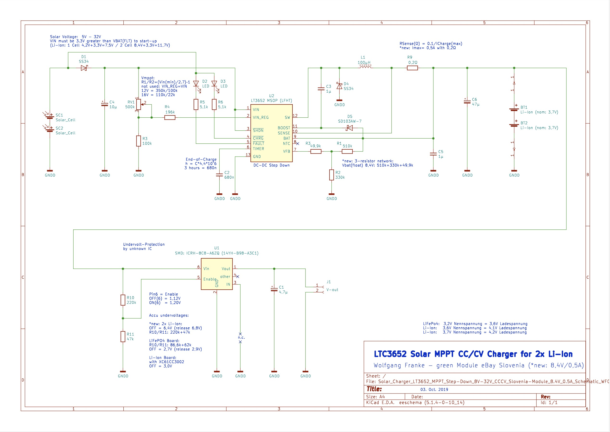
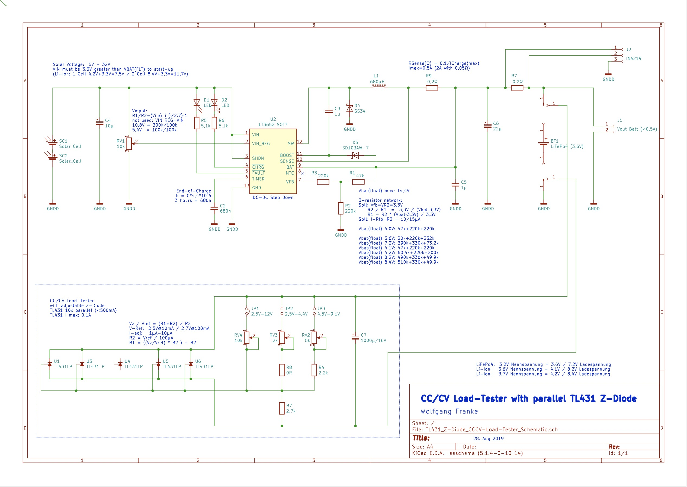

## This Git-Epic will tell you the story of building a Solar Power solution for many IoT devices. In my case it's an autonomous remote control for a battery powered Roller Blind, based on a Philips Hue Module within my Home Automation application.

This story contains 5 work major tasks:

1. Using a Roller Blind with an integrated motor and battery pack, USB chargable, that can be operated (up/down) by e.g. pulling a string on the Roller Blind, and that will be enhanced to get triggered by an Zigbee module too.

2. Connecting a Zigbee switch module to open/close the Roller Blind remotely by your Home Automation application. I show you how to re-use an ordinary Philips Hue module from an older Hue White E27 bulb.

3. Building a Solar Charger to supply both, the Roller Blind and the ZigBee module, to let them work 24x7 independently from a wall socket (I use 2 cheap solar modules, an LT3256 MPPT solar Li-Ion charger controller, and made a Li-Ion battery emulator based on TL431 voltage adjustable shunt regulators).

4. Programming a Power Meter to measeure the solar energy harvested every day and to visualize it on an IoT Cloud (implemented with Arduino: ESP32, INA219, OLED, WiFi Manager, NTP, ThingSpeak by MathWorks).

5. Integrating all pieces: connect the Philips Hue module to the Roller Blind, use a LTC3588 as very efficient voltage converter to 3,3 Volts for the Hue Module, trigger the Roller Blind up/down using a Home Automation solution, connect the Solar Charger, use the Power Meter to measure and visualize the charge energy and battery status of the Roller Blind.

## 1 - The Roller Blind

The Roller Blind I got from eBay is made by "Coulisse B.V. Vonderweg 48 7468 DC Enter The Netherlands". 

It's easy to disassemble and all necessary connection points are well documented on the circuit board.
A 3 stranded wire is soldered to the pads and will connect Vdd=8,4V and GND and the Key1-trigger pin (active low) to the outside Hue Module, as shown here:

Roller Blind interface documentation: 
- Pad 8,6V: This positive battery voltage pin (as it is 2x Li-Ion, it should be 8,4V) will be used to charge the battery by solar power via MPPT controller, as well as to generate the 3.3V power required by the Hue Zigbee module.
- Pad GND: That is negative battery voltage pin from Roller Blind, it connects to GND of the Hue module and to the GND of the solar Module and MPPT controller.
- Pad Key1: This is the trigger pin to move the blind up/down. It's L-active and needs to be Low for between 0,5s to 2 sec to trigger. FYI: in that Roller Blind circuitry, the trigger pin is the output of an Hall-IC with a Pull-up of 47K, which fires when a manual handle is pulled.
- Pad 3,3V: unused (the Roller Blind circuit uses the linear VDO TLV704-33 to generate it's internal 3.3 Volts. To reduce the energy consumption of an external circuit, especially of the used Hue module, it is much more energy efficient to use little power switch converter to generate 3.3V from the 8.4V battery power.)

## 2 - Hacking a Philips Hue Module from Hue White E27 bulb

Integrating the remote control of an Roller Blind is not sold or provided out-of-the-box (affordable) by the major Home Automation brands.
I decided to use some Philips Hue technology to control my Roller Blind, because that would easily integrate into my existing Home Automation network which already includes a Philips Hue Bridge.

But where to get a single Hue Module to control an homemade IoT solution? 
Here, a big thank you to  "Kalte Lötstelle" who published videos on disassembling a Philips Hue White E27 bulb: 
https://www.youtube.com/watch?v=yIImEukDihs 
https://www.youtube.com/watch?v=CxE5SwzcmWU

The following photo shows my result of getting the Hue module out of the bulb. I continued debugging the Hue module circuit and got it working with external 3.3V quickly. By using my oscilloscope and the Hue-App I also found the output-pin sending the PWM signal as 3.3V TTL.

Philips Hue Module interface documentation: 
- Input pad 3.3V: input for +3.3V (the power consumption of the Hue module is ≈20mA)
- Input Pad GND:  input for 0V
- left double layer GND: both copper planes need to be connected here
- PWM out: the 3.3V PWM signal is generated by a MOSFET transistor 2N2007 with a Pull-Up of 600k.
- not used: this Philips Hue module can be powered by an 5V to 12V source, and then provides +3,3V on the 3,3V pad.

## 3 - Solar Cells and the LT3256 MPPT Li-Ion charger controller

After measuring the energy harvesting results of Solar Cell modules with different sizes, Watts and Voltages, I decided to mount 2 thin traveller modules of 12 Volt and connect them in series. That way they can produce up to 1A at 28V in full sunshine, but I let the MPPT-controller reduce I-max to 0,5A for charging the batteries in the Roller Blind. The choosen Solar cells are able to generate some Milli-Amperes at 16V power point on a cloudy day, that should be enough to compensate the consumption of the Philips Hue module. 
 
Let's do some math: 
Hue Module: 
power needs:  3,3V * 20mA = 66mW 
running 24h:  24h * 66mW = 1600 mWh (power consumption in 1 day) 
 
Solar Modul: 
case-1: 16V * 100mA = 1600 mW (theoretically) 
=> would need 1 hour of good sunshine to compensate the daily consumption of the Hue Module  
case-2: Solar Modul:  16V * 50mA = 800 mW (practically the conversion efficiency of the MPPT controller is 50%) 
=> needs 4 hour of little sunshine to compensate the daily consumption of the Hue Module  

 
The LT3256 is a solar MPPT controller and Li-Ion charger IC. I modified the LT3256 borad to get a MPP of 16V and a charge voltage for 8,4V (for 2 Li-Ion) cells, with a maximum current of 0,5A.

 
To test the energy harvesting from the solar cells with the LT3256 MPPT controller, there was a need for a sink of the current like a Li-Ion cell would do it. For that I made the Li-Ion battery emulator based on a couple of TL431 voltage adjustable shunt regulators.

## 4 - Arduino ESP32 Solar Power-Meter

A
