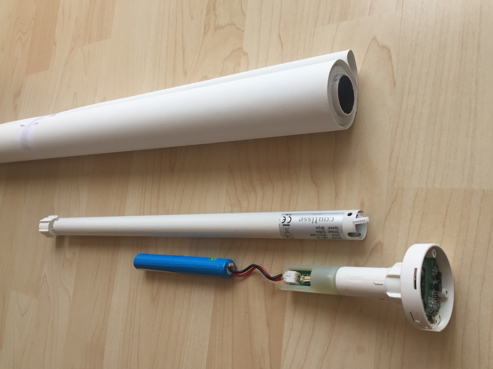
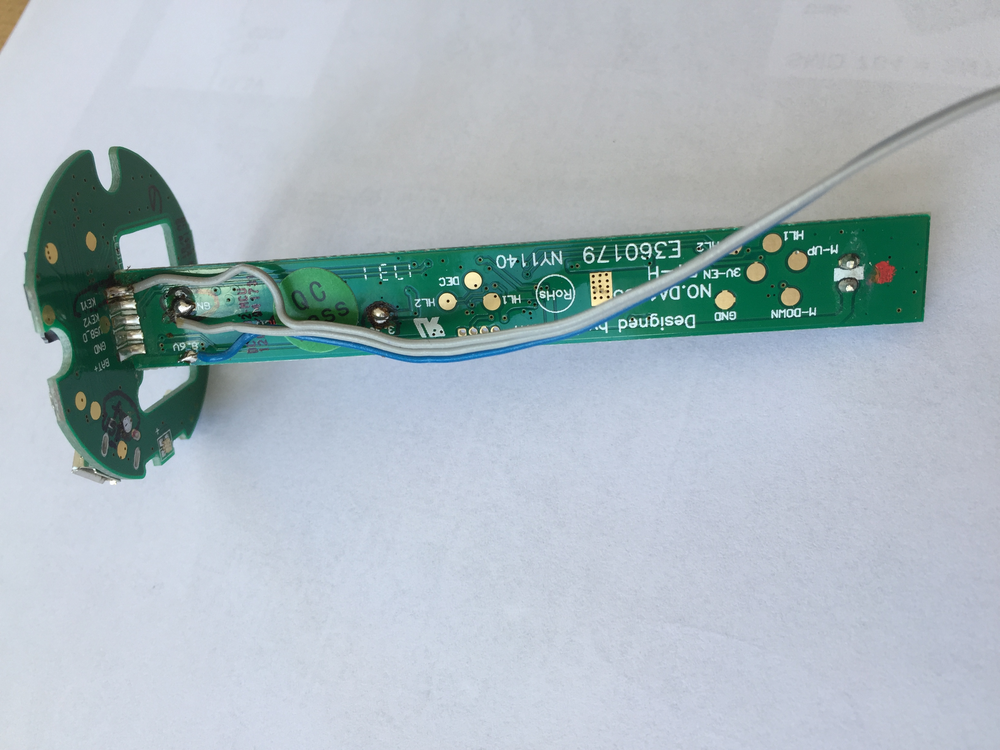
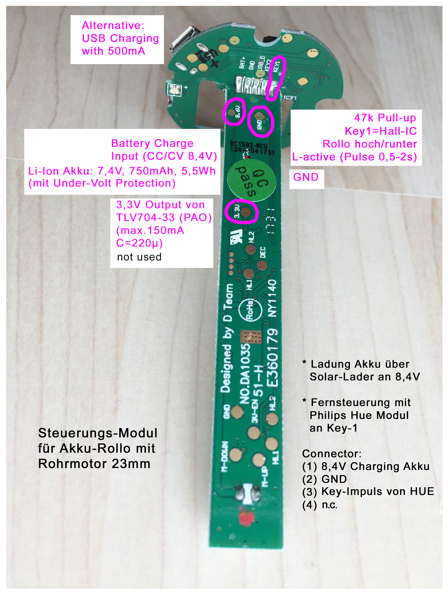
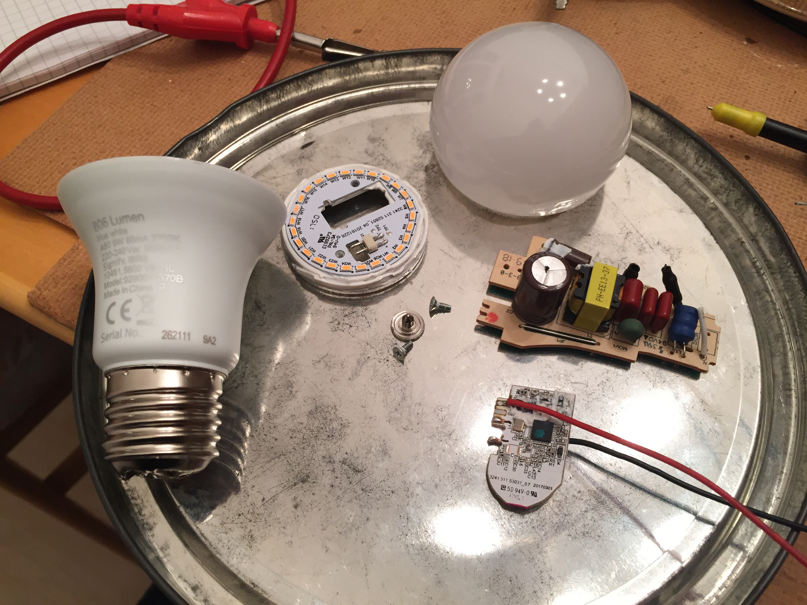

## This Git-Epic will tell you the story of building a Solar Power solution for many IoT devices. In my case it's an autonomous remote control for a battery powered Roller Blind, based on a Philips Hue Module within my Home Automation application.

This story contains 5 work major tasks:

1. Using a Roller Blind with an integrated motor and battery pack, USB chargable, that can be operated (up/down) by e.g. pulling a string on the Roller Blind, and that will be enhanced to get triggered by an Zigbee module too.

2. Connecting a Zigbee switch module to open/close the Roller Blind remotely by your Home Automation application. I show you how to re-use an ordinary Philips Hue module from an older Hue White E27 bulb.

3. Building a Solar Charger to supply both, the Roller Blind and the ZigBee module, to let them work 24x7 independently from a wall socket (I use 2 cheap solar modules, an LT3256 MPPT solar charger controller, and made a Li-Ion battery emulator based on TL431 voltage adjustable shunt regulators).

4. Programming a Power Meter to measeure the solar energy harvested every day and to visualize it on an IoT Cloud (implemented with Arduino: ESP32, INA219, OLED, WiFi Manager, NTP, ThingSpeak by MathWorks).

5. Integrating all pieces: connect the Philips Hue module to the Roller Blind, use a LTC3588 as very efficient voltage converter to 3,3 Volts for the Hue Module, trigger the Roller Blind up/down using a Home Automation solution, connect the Solar Charger, use the Power Meter to measure and visualize the charge energy and battery status of the Roller Blind.

## 1 - The Roller Blind

The Roller Blind I got from eBay is made by "Coulisse B.V. Vonderweg 48 7468 DC Enter The Netherlands". 

It's easy to disassemble and all necessary connection points are well documented on the circuit board.
A 3 stranded wire is soldered to the pads and will connect Vdd=8,4V and GND and the Key1-trigger pin (active low) to the outside Hue Module, as shown here:

Roller Blind interface documentation: 
- Pad 8,6V: This positive battery voltage pin (as it is 2x Li-Ion, it should be 8,4V) will be used to charge the battery by solar power via MPPT controller, as well as to generate the 3.3V power required by the Hue Zigbee module.
- Pad GND: That is negative battery voltage pin from Roller Blind, it connects to GND of the Hue module and to the GND of the solar Module and MPPT controller.
- Pad Key1: This is the trigger pin to move the blind up/down. It's L-active and needs to be Low for between 0,5s to 2 sec to trigger. FYI: in that Roller Blind circuitry, the trigger pin is the output of an Hall-IC with a Pull-up of 47K, which fires when a manual handle is pulled.
- Pad 3,3V: unused (the Roller Blind circuit uses the linear VDO TLV704-33 to generate it's internal 3.3 Volts. To reduce the energy consumption of an external circuit, especially of the used Hue module, it is much more energy efficient to use little power switch converter to generate 3.3V from the 8.4V battery power.)

## 2 - hacking a Philips Hue Module from Hue White E27 bulb

Integrating the remote control of an Roller Blind is not sold or provided out-of-the-box (affordable) by the major Home Automation brands.
I decided to use some Philips Hue technology to control my Roller Blind, because that would easily integrate into my existing Home Automation network which already includes a Philips Hue Bridge.

But where to get a single Hue Module to control an homemade IoT solution?

Philips Hue Module interface documentation: 

