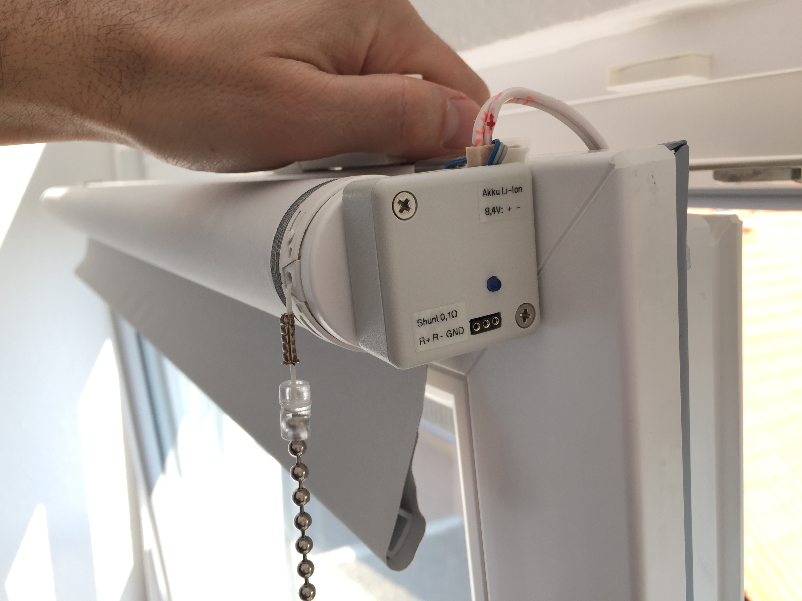

# A Solar Powered Philips Hue Module (a 3,3V PWM dimmer)

## This project will tell you the story of building a Solar Power solution for IoT devices operating 24x7. In my case it's an autonomous remote control receiver for a battery powered Roller Blind, based on a Philips Hue Module within my Home Automation application.

This story contains 5 work major tasks:

1. Using a Roller Blind with an integrated motor and battery pack, USB chargable, that can be operated (up/down) by e.g. pulling a string on the Roller Blind, and that will be enhanced to get triggered by an Zigbee module too.

2. Connecting a Zigbee switch module to open/close the Roller Blind remotely by your Home Automation application. You will learn how to re-use an ordinary Philips Hue module from an older Hue White E27 bulb.

3. Building a Solar Charger to supply both, the Roller Blind and the ZigBee module, to let them work 24x7 independently from a wall socket (I use 2 cheap solar modules, an LT3256 MPPT solar Li-Ion charger controller, and made a Li-Ion battery emulator based on TL431 voltage adjustable shunt regulators).

4. Programming a Power Meter to measeure the solar energy harvested every day and to visualize it on an IoT Cloud (implemented with Arduino: ESP32, INA219, OLED, WiFi Manager, NTP, ThingSpeak by MathWorks).

5. Integrating all pieces: connect the Philips Hue module to the Roller Blind, use a LTC3588 as very efficient voltage converter to 3,3 Volts for the Hue Module, trigger the Roller Blind up/down using a Home Automation solution, connect the Solar Charger, use the Power Meter to measure and visualize the charge energy and battery status of the Roller Blind.

## 1 - The battery powered Roller Blind
https://github.com/WolfgangFranke/Solar-Powered_Hue-Module/tree/master/1_RollerBlind

The Roller Blind I got from eBay is made by "Coulisse B.V. Vonderweg 48 7468 DC Enter The Netherlands". 
It has a motor insight, as well a Li-Ion battery with 7,4V and 750mAh, that means a charge voltage of 8,4V and a capacity of 5,5Wh available to drive the roller blind up/down, and used to power the Philips Hue remote control receiver. It also has a USB charger port, but that one is not useful to charge from solar power.

It's easy to disassemble and all necessary connection points are well documented on the circuit board.
The 3 stranded wire is soldered to the pads and will connect Vdd=8,4V and GND and the Key1-trigger pin (active low) to the outside Hue Module, as shown here:

Roller Blind interface documentation: 
- Pad 8,6V: This positive battery voltage pin (as it is 2x Li-Ion, it should be 8,4V) will be used to charge the battery by solar power via MPPT controller, as well as to generate the 3.3V power required by the Hue Zigbee module.
- Pad GND: That is negative battery voltage pin from Roller Blind, it connects to GND of the Hue module and to the GND of the solar Module and MPPT controller.
- Pad Key1: This is the trigger pin to move the blind up/down. It's L-active and needs to be Low for between 0,5s to 2 sec to trigger. FYI: in that Roller Blind circuitry, the trigger pin is the output of an Hall-IC with a Pull-up of 47K, which fires when a manual handle is pulled.
- Pad 3,3V: unused (the Roller Blind circuit uses the linear VDO TLV704-33 to generate it's internal 3.3 Volts. To reduce the energy consumption of an external circuit, especially of the used Hue module, it is much more energy efficient to use little power switch converter to generate 3.3V from the 8.4V battery power.)

## 2 - Hacking a Philips Hue Module from Hue White E27 bulb
https://github.com/WolfgangFranke/Solar-Powered_Hue-Module/tree/master/2_HueModule_fromWhiteE27bulb

A seamlessly integrated remote control of an Roller Blind is not sold or provided out-of-the-box (affordable) by the major Home Automation brands.
I decided to use some Philips Hue technology to control my Roller Blind, because that would easily integrate into my existing Home Automation network which already includes a Philips Hue Bridge.

But where to get a single Hue Module to control an homemade IoT solution? 
Here, a big thank you to  "Kalte Lötstelle" who published videos on disassembling a Philips Hue White E27 bulb: 
https://www.youtube.com/watch?v=yIImEukDihs 
https://www.youtube.com/watch?v=CxE5SwzcmWU

The following photo shows my result of getting the Hue module out of the bulb. I continued debugging the Hue module circuit and got it working with external 3.3V quickly. By using my oscilloscope and the Hue-App I also found the output-pin sending the PWM signal as 3.3V TTL.

Philips Hue Module interface documentation: 
- Input pad 3.3V: input for +3.3V (the power consumption of the Hue module is ≈20mA)
- Input Pad GND:  input for 0V
- left double layer GND: both copper planes need to be connected here
- PWM out: the 3.3V PWM signal is generated by a MOSFET transistor 2N7002 with a Pull-Up of 600k.
- not used: this Philips Hue module can be powered by an 5V to 12V source, and then provides +3,3V on the 3,3V pad.

## 3 - Solar Cells and the LT3256 MPPT Li-Ion charger controller
https://github.com/WolfgangFranke/Solar-Powered_Hue-Module/tree/master/3_SolarModules_MPPT-Controller

After comparing the energy harvesting results of Solar Cell modules with different sizes, Watts and Voltages, I decided to mount 2 thin traveller modules of 12 Volt and connect them in series. That way they can produce up to 1A at 28V in full sunshine (measured, not by the marketing sheet). The choosen Solar cells are also able to generate some Milli-Amperes at 16V power point on a cloudy day, that should be enough to compensate the consumption of the Philips Hue module. 
 
Let's do some math: 
-Hue Module: 
power needs:  3,3V * 20mA = 66mW 
running 24h:  24h * 66mW = 1600 mWh (power consumption in 1 day) 
-Solar Modul: 
case-1: 16V * 100mA = 1600 mW (theoretically) 
=> would need 1 hour of good sunshine to compensate the daily consumption of the Hue Module  
case-2: Solar Modul:  16V * 50mA = 800 mW (practically the conversion efficiency of the MPPT controller is 50%) 
=> needs 4 hour of little sunshine to compensate the daily consumption of the Hue Module  

 
The LT3256 is a solar MPPT controller and Li-Ion charger IC. I modified the LT3256 board to set the MPP to 16V and to provide a charge voltage for 8,4V (for 2 Li-Ion) cells, with a maximum current of 0,5A. Below is the final circuit of the LT3256 board I use.

 
To test the energy harvesting from the solar cells with the LT3256 MPPT controller, as well as the CCCV behaviour, you need an empt battery pack, or even better a sink simulating the charge current of a Li-Ion cell. For that I made a simple Li-Ion battery emulator, based on a couple of TL431 voltage adjustable shunt regulators.

## 4 - Arduino ESP32 Solar Power-Meter
https://github.com/WolfgangFranke/Solar-Powered_Hue-Module/tree/master/4_Arduino_ESP32_SolarPowerMeter

The Power Meter measures the solar energy harvested every day and visualizes it on an OLED as well as on the IoT Cloud from ThingSpeak by MathWorks (https://www.thingspeak.com). 
The implementation of the Power Meter is based on an ESP32 Picokit v4, but the pin layout can easily be changed to many other ESP32 deveopment boards. 
 
The Arduino source code of the Power Meter can be found here: 
https://github.com/WolfgangFranke/Solar-Powered_Hue-Module/tree/master/4_Arduino_ESP32_SolarPowerMeter/Solar_Power_Meter_ESP32_INA219_OLED-SH1106_v360 
 
The Arduino software uses the following libraries:
- for WiFi manager the IotWebConf library from Balazs Kelemen: https://github.com/prampec/IotWebConf
- for OLED SH1106 the U8g2lib from Oli Kraus: (https://github.com/olikraus/u8g2/wiki/u8g2reference
- for INA219 current sensor the Adafruit INA219 Library: https://github.com/adafruit/Adafruit_INA219
- the ThingSpeak library from MathWorks: https://github.com/mathworks/thingspeak-arduino
 

As of year 2020, it's easy to open a free ThingSpeak account and setup a personal IoT channel to store lots of IoT data. 
This Arduino software is configured to send data to the IoT Cloud every 15 minutes. You can conveniently use the ThingSpeak portal (https://www.thingspeak.com) or for example the Thingview App (by Marcelo Prolo, in iOS App store) to track your power data as nice graphs.
 
 

## 5 - Putting all pieces together
https://github.com/WolfgangFranke/Solar-Powered_Hue-Module/tree/master/5_PutAllPiecesTogether

Integrating all pieces: 
- make the circuitry to connect the Philips Hue module to the Roller Blind, 
- use a LTC3588 as very efficient voltage converter from battery 8,4V to 3,3 Volts for the Hue Module, 
- trigger the Roller Blind up/down using a Home Automation solution, 
- connect the Solar Charger MPPT controller, care for cable diameter in case of larger cable length,
- use the Arduino Power Meter to measure and visualize the charge energy and battery status of the Roller Blind,
- login to the ThingSpeak IoT Cloud portal, or use the Thingview App (iOS) to visualize your solar charge power data.
 
The Solar Modules are mounted on the roof near the window, the small LT3652 MPPT controller board is mounted on the window frame, and the little circuit to translate Hue's PWM signal to trigger the Roller Blind, as well as the LTC3588 to generate 3,3V from 8,4V, are soldered into a little plastic box, which is taped to the Roller Blind.  
 

The Shunt of 0,1 Ohm to measure the solar charge current can be accessed on the 3 pin header, were an INA219 module of the Arduino ESP32 Solar Power-Meter can be connected.  
https://github.com/WolfgangFranke/Solar-Powered_Hue-Module/tree/master/4_Arduino_ESP32_SolarPowerMeter
 

All connectors are stable and secured against vibrations from operating the window.
 

 
This circuit below shows how all parts work together.  
Important to understand is that my Home Automation Switch will generate an 1s impuls to trigger the Roller Blind going up/down. After pressing a button of my Home Automation system (physically or in App), a 1 second High-pulse will be generated by setting the Philips Hue module from 0% to 100%, wait for 1 sec, and then switch back to 0%. The RC-element and transistor BS170 filter out PWM duty <50% for the rare moment of powerloss of the Hue module, because it is configured to restart with 1% PWM after each power-on.
 

 
The LTC3588 can act as a very efficient voltage converter for small loads. With the components used in this circuit, I tested a transmission efficiency of ≈90% for converting battery 8,4V to the 3,3V at 20mA consumed by a Philips Hue module. Using the LTC3588 for voltage conversation is ≈2,5 times more efficient than using a linear voltage regulator, that means your battery can power the Philips Hue module ≈2,5 times longer when encountering bad solar recharge conditions!
But soldering the LTC3855 manually is a bit difficult, because the bottom of the IC needs to be connected to GND. I used a tiny breakout board and drilled a whole to connect GND.
 

 
 
Finally, after all pieces got connected successfully, you want to go to the ThingSpeak IoT Cloud portal (https://www.thingspeak.com), or use e.g. the Thingview App (by Marcelo Prolo, in iOS App store) to track your power data over a longer time range. 
The screenshot below shows the graphical output on ThingSpeak, Field-2 is the battery voltage. It can be seen that day 3 and day 4 were very cloudy and the solar module was not able to deliver enough energy to compensate the consumption of the preceding day (24h). 
To lower the risk of a service interruption for the IoT device, the battery needs to be large enough to buffer a couple of cloudy days, and the solar system needs to be strong enough to quickly re-charge the battery in case of good sunshine. That can be seen in day 5, when the battery was very quickly charged up to 100% (8,4V), and after the CCCV charge-stop with some discharging, then also a second complete re-charge was done that day.  

 
